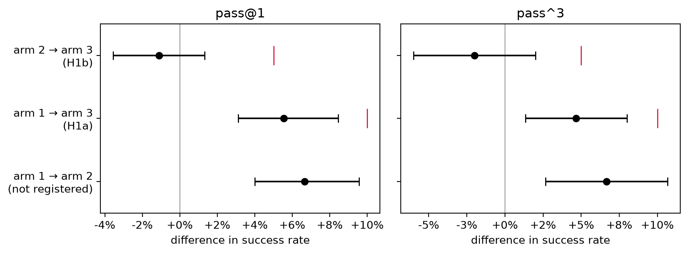
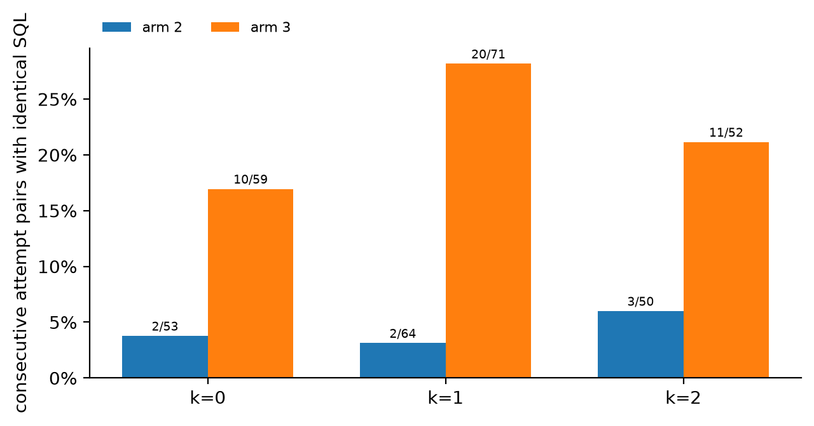
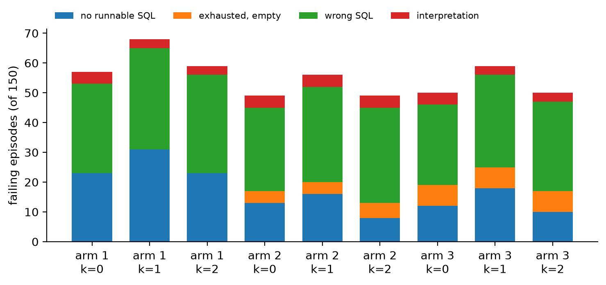

# Agent Reliability Bench

A controlled study of how scaffold choice affects agent reliability,
using text2sql as the testbed. The eval harness is the product;
the agent is the test subject.

Tool model: Qwen2.5-Coder-1.5B + QLoRA adapter
(see [text2sql](https://github.com/Sean-LeBlanc14/text2sql-finetune)).
The un-fine-tuned base model stands in as the tool in one ablation.

## Preregistered Hypotheses (written 2026-07-15, before implementation)

- **H1a (total scaffold effect):** Agent + repair (arm 3) lifts task
  success by ≥10 points over single-shot (arm 1).
- **H1b (error-feedback effect):** Agent + repair (arm 3) lifts task
  success by ≥5 points over the resample-only agent (arm 2) at equal
  retry budget — i.e., error feedback contributes beyond bare resampling.
- **H2 (stability cost):** pass^3 (all 3 of 3 runs correct) improves
  less than pass@1 across the ladder — repair raises average success
  but is unstable run-to-run.

*Amended 2026-07-19, before any agent data was collected: H1b restated as the
error-feedback effect at equal retry budget, matching the pinned arm-2 (resample-only) semantics.*

### Pre-registered limitation, repair prompts are out of distribution

The tool adapter was fine-tuned on a single zero-shot turn (schema, question,
`SQL:` cue) with bare SQL as the completion. Arm 3 injects the previous query
and the executor error into that question slot, a shape the adapter never saw
in training. Arm 3 therefore carries a format cost that arms 1 and 2 do not.

A five-task render check before code freeze found the tool reproducing the
previous query verbatim when shown it, consuming a retry attempt. The tool
repeated on 2 of 5 tasks, while a same-seed arm-2 control resampling the
original prompt produced distinct SQL on all 12 attempts, so the repetition is
attributable to the repair context rather than to sampling. One alternate
rendering of the closing instruction was tried, replacing "Write a single
corrected SQL query that answers the question." with "Write a new SQL query
that fixes the error and answers the question." At identical seeds it was not
better, so it was reverted and the original wording stands.

Consequence for H1b. A weak or null H1b is consistent with two explanations,
that error feedback carries little value for this agent, or that this tool
cannot consume error feedback in this format. The design cannot separate them.
H1a is unaffected in kind, since its estimand is the total effect of the
scaffold as built and format cost is part of that.

For arms 2 and 3 we will report the share of re-query attempts whose SQL is
byte-identical to the immediately preceding attempt. Because seeds are
arm-independent, the two arms resample under matched seeds and differ only in
prompt content, so a gap between them isolates the effect of the repair
context on tool variance.

## Design

### Architecture

Two models. Both are held constant across the three main arms; the orchestrator
is held constant everywhere, as experimental apparatus, while the tool and the
scaffold are the manipulated variables.

- **Orchestrator** — a frontier API model (cheap capable tier, temp 0), the fixed apparatus.
  Model string pinned and recorded in every trace.
- **Tool** — the Qwen2.5-Coder-1.5B + QLoRA adapter, behind `generate_sql()`. One job:
  question (+ optional error/prev SQL) in, SQL out.

**No-SQL-authorship constraint:** the orchestrator never writes SQL. Enforced structurally — every
tool output carries an ID, and the executor only runs SQL bearing a valid tool-output ID. Unit tests
assert the invariant (`tests/test_invariants.py`).

**Tool-input contract:** inputs limited to `(question)` on the first attempt, or
`(question + executor error + previous SQL)` on repair. No free-text rephrasing — closes the
SQL-laundering-via-input leak.

Three-arm comparison, same orchestrator + tool, same benchmark:

1. **Single-shot** — one `generate_sql` call → execute → extraction → `ANSWER`. No loop.
2. **Agent, no repair (resample-on-failure)** — on a repair trigger, re-query with the
   **original question only** (fresh tool resample at temp > 0). Step-capped. Isolates the pure
   inference-compute effect of retrying.
3. **Agent + repair (resample-with-error-feedback)** — **same step cap as arm 2**, but the re-query
   carries question + executor error + previous SQL. Isolates the value of information beyond compute.

Arms 2 and 3 share an identical step cap, so H1b never confounds feedback with extra attempts.
**Repair triggers (exactly two, both `if` statements):** (1) SQL execution error, (2) empty result set.
Because a successful non-empty execution terminates the episode, repair fires only on already-failed
states and cannot degrade a correct answer. This is a property of the conservative trigger set, not an
empirical finding.

Grading: each arm emits `ANSWER: <value(s)>` through a **shared answer-extraction prompt** (one module,
imported by every arm, so extraction is held constant and the ladder isolates loop effects), parsed and
graded by normalized exact-match against executed gold rows. Row order is enforced only when the gold
query orders its result; otherwise comparison is multiset (duplicate-sensitive). Column permutations are
accepted, numerics are coerced and rounded, and unparseable answers are their own failure status. No LLM
judge. The comparison core is inherited from the Project 1 scorer, where it was validated by unit tests
and produced the published execution-accuracy numbers; the grader here adds the answer-parsing layer
(46 tests total). **Secondary diagnostic (logged, not primary):** row-level match of the final executed
SQL against gold; divergence between the primary (ANSWER) result and this is the **interpretation-failure
rate** — a wrong answer off a right query, observable in every arm.

### Ablation, base tool

One ablation swaps the fine-tune out of the tool slot. Un-fine-tuned
Qwen2.5-Coder-1.5B-Instruct runs behind `generate_sql()` in arms 2 and 3 under
the same benchmark, the same prompt render, the same repair render, the same
seed derivation and the same 4-bit quantization, so the adapter is the only
variable. Implementation is `adapter_dir=None` skipping the PeftModel wrap,
bound to the `ablation` tag in `run_agent.py` so a base tool cannot be paired
with a main-run tag by mistake.

The ablation is exploratory. It carries no confirmatory status and no
confidence intervals, and it reports raw counts with denominators shown. It
runs at k=1, which forecloses pass^3, band-shift and consistency reads on the
base tool; the verbatim-repetition rate is the load-bearing number and does not
need k=3. Base single-shot performance comes free from arm 2 attempt 0, which
fires unconditionally, so no third cell was needed.

## Benchmark

150 questions sampled from Spider dev (1,034 examples), proportionally
stratified by the official Spider hardness classifier (easy/medium/hard/extra,
via vendored [taoyds/spider](https://github.com/taoyds/spider) evaluation
code). Sampling is deterministic (seed 42) and fully regenerable:
classify -> filter -> sample -> execute gold SQL.

**Eligibility rules (applied before sampling, before any arm ran):** tasks
whose gold result exceeds 20 rows are excluded (70/1,034, 6.8% of the pool).
The answer-emission grading format requires the agent to output the complete
result set; beyond ~20 rows the task measures output-length stamina rather
than reliability. The threshold was fixed from the pool's row-count
distribution (p95 = 28, then a cliff to 753+) prior to measuring any arm.

Empty gold results (0 rows) are excluded at the same pre-sampling filter, since the
empty-result repair trigger would otherwise fire on a correct query that legitimately
returns nothing and penalize it. 49/1,034 excluded from the pool. This rule was added
2026-07-19, before any agent data was collected; the deterministic seed-42 sample was
regenerated so that both gold-shape eligibility rules apply before the draw.

Each task stores the question, db_id, gold SQL, executed gold rows, official
difficulty, and an `order_matters` flag (true iff the gold query has a
top-level `ORDER BY` — subquery ORDER BY does not constrain outer row order).
Spider dev obtained via HuggingFace export; train/dev disjointness verified
during Project 1's contamination audit.

## Results

Nine main cells, 1,350 episodes, frozen at tag `p2-frozen` (commit `9ca1c7e`,
config hash `d05cf2c0b135`). Traces are the record and every number below is
recomputed from them by the scripts in `analysis/`. Per-arm detail lives in the
reports linked at the end of this section rather than being restated here.

**Headline finding: the scaffold works and the error-feedback channel inside it
does not.** Adding a retry loop lifts task success by 6.7 points. Adding the
executor error and the previous query to that retry buys nothing measurable on
top of it, and a +5-point effect is ruled out rather than merely unobserved. The
mechanism is visible in the tool's own output — handed its previous query, the
tool re-emits it byte-for-byte on roughly a fifth to a quarter of repair
attempts, spending the retry without changing the candidate.

### pass@1 by arm

| Arm | run 0 | run 1 | run 2 | pooled (450) |
|---|---|---|---|---|
| 1, single-shot | 93/150 | 82/150 | 91/150 | 59.1% |
| 2, resample-on-failure | 101/150 | 94/150 | 101/150 | 65.8% |
| 3, resample-with-error-feedback | 100/150 | 91/150 | 100/150 | 64.7% |

Run-to-run spread inside an arm (arm 1 ranges 82 to 93) is wider than the gap
between arms 2 and 3, which is why the contrasts below are paired. Attempt 0 is
seed-matched across arms, so a paired bootstrap over the 150 tasks yields
intervals about 2.5 points wide against about 7 points for a single arm.

### pass^3 by arm

| Arm | solved in all 3 runs | 95% CI |
|---|---|---|
| 1 | 74/150 (49.3%) | [41.3, 58.0] |
| 2 | 84/150 (56.0%) | [48.0, 64.0] |
| 3 | 81/150 (54.0%) | [46.0, 62.0] |

### Pre-registered contrasts

Paired bootstrap, 10,000 draws, seed 0, percentile method, resampling the 150
benchmark tasks with all arms scored on the same draw. The three runs are held
fixed, so the intervals cover benchmark composition and not seed variance.

| Contrast | pass@1 | 95% CI | pass^3 | 95% CI |
|---|---|---|---|---|
| arm 1 → arm 2 | +6.7 | [+4.0, +9.6] | +6.7 | [+2.7, +10.7] |
| arm 1 → arm 3 (H1a) | +5.6 | [+3.1, +8.4] | +4.7 | [+1.3, +8.0] |
| arm 2 → arm 3 (H1b) | −1.1 | [−3.6, +1.3] | −2.0 | [−6.0, +2.0] |



**H1a, predicted ≥10 points, observed +5.6 [+3.1, +8.4]. Not supported.** The
effect is real and clearly above zero, and it is under half the registered size.
The interval excludes 10, so this is a bounded overprediction rather than an
underpowered null.

**H1b, predicted ≥5 points, observed −1.1 [−3.6, +1.3]. Not supported.** Two
statements are needed and both carry weight. There is no detectable difference
between arms 2 and 3 in either direction, and a +5-point effect is ruled out,
since the interval excludes 5 comfortably. The negative point estimate is not
evidence that error feedback hurts.

**H2, predicted pass^3 improves less than pass@1 across the ladder. Unsupported
at arm 2, indeterminate at arm 3.** From arm 1 to arm 2 the two metrics move
identically, +6.7 on both, not less. From arm 1 to arm 3, pass^3 gains 4.7
against pass@1's 5.6, directionally as predicted but by 0.9 points, with
intervals that overlap almost entirely. The stability cost H2 anticipated is not
present in the data.

### Verbatim repetition on repair (pre-registered)

Share of re-query attempts whose SQL is byte-identical to the immediately
preceding attempt. Exact string equality, no normalization.

| Arm | run 0 | run 1 | run 2 |
|---|---|---|---|
| 2, resample-on-failure | 2/53 (3.8%) | 2/64 (3.1%) | 3/50 (6.0%) |
| 3, resample-with-error-feedback | 10/59 (16.9%) | 20/71 (28.2%) | 11/52 (21.2%) |



The metric is undefined for arm 1, which has no re-query attempts, and is not
zero there. The gap is roughly 5x and runs the same direction in all three
paired cells, on 182 real repair pairs. This is the five-task render check from
the pre-registered limitation reproducing at scale. Since the two arms resample
under matched seeds and differ only in prompt content, the gap is attributable
to the repair context.

### Where the H1a gain comes from

Failure decomposition per cell, from `analysis/failure_breakdown.py`.

| Bucket | arm 1 | arm 2 | arm 3 |
|---|---|---|---|
| no runnable SQL | 23 / 31 / 23 | 13 / 16 / 8 | 12 / 18 / 10 |
| tool wrong (runnable, wrong rows) | 30 / 34 / 33 | 28 / 32 / 32 | 27 / 31 / 30 |
| final result empty | 9 / 9 / 7 | 4 / 4 / 5 | 7 / 7 / 7 |
| degraded (empty → unrunnable) | 0 / 0 / 0 | 6 / 7 / 3 | 1 / 1 / 2 |



The retry loop roughly halves execution failures, and that is where the H1a gain
lives. Arms 2 and 3 recover them at the same rate, which is the mechanism-level
statement of the H1b null. Wrong-SQL falls slightly across the ladder rather
than rising. Arms 2 and 3 differ in what they leave behind: arm 2 churns and
occasionally breaks a query that had merely returned nothing, arm 3 sits still
and ends on an empty result more often.

Failure taxonomy over all 144 non-interpretation failures: every one is a wrong
query. `gave_up` and `hallucinated_answer` never fire, and no `ANSWER` invented a
value that was absent from the executed rows. Interpretation failure, a wrong
answer off a right query, sits at 3 to 4 per cell in all nine and does not move
with the scaffold. The unsupported-values check detects invented scalars only, so
the supportable claim is that no values were fabricated, not that extraction was
error-free.

### Ablation, base tool (exploratory)

Two cells, arms 2 and 3, k=1, un-fine-tuned base model behind `generate_sql()`.
Commit `b70a5a8`, tag `ablation`.

| | base arm 2 | base arm 3 |
|---|---|---|
| pass@1 | 92/150 (61.3%) | 86/150 (57.3%) |
| verbatim repetition | 4/78 (5.1%) | 37/88 (42.0%) |
| terminal: answered | 125 | 113 |
| terminal: exhausted, exec failed | 19 | 25 |
| terminal: exhausted, empty | 6 | 12 |

**The pre-registered OOD limitation closes in the opposite direction from the one
it anticipated.** The worry was that repair-shaped prompts are out of
distribution for the adapter, so the copying might be an artifact of fine-tuning
on a fixed format. Removing the fine-tune made the copying worse. Base copies at
42.0% against the adapter's 16.9 to 28.2%, so the adapter partially suppressed
whatever drives a 1.5B-class model to re-emit its previous query rather than
causing it. Read back onto Project 1, the fine-tune roughly halved
self-parroting.

The arm-2-to-arm-3 gap also opens rather than closing: base arm 3 is worse by 6
tasks, which is 4.0 percentage points, where the adapter's H1b contrast was −1.1
points. Swapping in a weaker tool did not reveal a feedback benefit that the
fine-tuned tool was hiding.

The scope boundary set before the run is now binding in the branch it
anticipated. A high base repeat rate means this ablation says nothing about
whether feedback helps a tool that actually varies on repair. That question stays
open and stays a limitation. The 42-versus-23 comparison is across tools and
across single runs, so it supports "base copies at least as much", not a precise
ratio.

Attempt-0 integrity held across the tool swap: both ablation arms show exactly
101 one-attempt episodes, which is only possible if attempt 0 was byte-identical
across arms.

### Mechanism (post-hoc, exploratory)

Everything in this subsection is exploratory. It was not pre-registered and it
carries no intervals.

The obvious explanation for the copying is that the repair message is sometimes
contentless: the empty-result trigger injects a canned constant, so there is
nothing to act on and nothing changes. The main run rejects this. Arm 3 copies at
21.3% (10/47) on empty-result repairs against 23.0% (31/135) on repairs carrying
a real SQLite error, with the direction flipping across cells. The driver is the
previous query being present in the prompt, not the error being uninformative.
In its strong form: the adapter re-emits a byte-identical query about a quarter of
the time even when handed a genuine executor error.

The ablation reverses this. Base concentrates its copying on empty-result
repairs in both arms, 15/23 (65.2%) against 22/65 (33.8%) in arm 3, and 2/15
(13.3%) against 2/63 (3.2%) in arm 2. So trigger-independence is a property of
the fine-tuned tool rather than of 1.5B-class tools handed their previous query,
and the contentless-feedback hypothesis that the main run rejected looks
supported on base. The honest framing is two tools that copy for apparently
different reasons, base when the feedback carries no information and the adapter
regardless. Denominators here are small and this is one ablation run against
three main runs, so evidential weight runs against the ablation wherever the two
disagree.

Attempt transitions, row-normalized and pooled per arm, show the same split.
From an execution error, arm 2 lands on exec error / empty / runnable rows at
55.6 / 9.5 / 34.9, arm 3 at 69.6 / 6.7 / 23.7. From an empty result, arm 2 at
39.0 / 41.5 / 19.5, arm 3 at 8.5 / 72.3 / 19.1. Arm 3 sits still and arm 2
churns.

Holding repeats out, arm 3 recovers 32/104 (30.8%) of non-repeat execution-error
origins against arm 2's 44/121 (36.4%), and 9/37 against 8/39 on empty results.
Most of arm 3's deficit runs through the copying channel and feedback looks close
to neutral once copies are removed. This conditions on an outcome and the two
excluded sets are not comparable populations, since arm 2's repeats are chance
collisions while arm 3's are copies, so it is suggestive only.

### Consistency

Tasks by how many of the three runs solved them.

| Arm | 0 of 3 | 1 of 3 | 2 of 3 | 3 of 3 |
|---|---|---|---|---|
| 1 | 45 | 18 | 13 | 74 |
| 2 | 37 | 14 | 15 | 84 |
| 3 | 36 | 18 | 15 | 81 |

The unstable band looks flat at 31 / 29 / 33, which suggested at first that the
scaffold buys capability and not consistency. The band-shift matrix shows that
read was wrong. Going arm 1 to arm 2, ten of arm 1's 31 unstable tasks move to
always-solved while eight never-solved tasks flow in to replace them. The
scaffold does stabilize, one band at a time, and never-to-always transitions are
essentially absent (0 for arm 2, 1 for arm 3).

Arm 1 to arm 2 and arm 1 to arm 3 are monotone with zero regressions, but that
is architectural rather than empirical: attempt 0 is seed-matched and
byte-identical to arm 1, so a regression would indicate a broken pairing. Its
value is as an integrity check that seed matching held across all 450 episodes.
Arm 2 to arm 3 is the only non-monotone pair, with 6 always-solved tasks
becoming unstable and 2 unstable becoming never-solved against 6 improving.
That is the H1b null restated at task level.

### Reproducibility

Two independent determinism checks exist.

The first pair of ablation traces stamped a commit predating the `run_agent.py`
change that selects the base tool, so both cells were deleted and re-run under
the correct commit. They came back byte-identical on pass@1, attempt
distributions, terminal and trigger counts, and the per-episode pass/fail
string. Seed derivation therefore reproduces exactly across processes on the same
hardware and library versions.

Separately, arm 1 run 0 reproduces the earlier pipeline-calibration run exactly
despite a different config hash. `git log -p -- agent/config.py` confirms this is
expected rather than a collision: the only CONFIG changes across that span added
`agent.max_attempts` and the repair block, both read solely by the retry loop,
which single-shot never enters. That is a second reproducibility confirmation
across a two-week gap and a config change.

### Tier discipline

Pre-registered and reported as confirmatory: pass@1, pass^3, the confidence
intervals, and the verbatim-repetition rate. Everything else is post-hoc and
exploratory, specifically the trigger split, the attempt-transition table, the
repeats-held-out decomposition, the band-shift matrix, and the degradation and
final-empty counts. The entire base-tool ablation is exploratory.

### Reports

Per-arm reports carry provenance, difficulty breakdowns and the full failure
decomposition. All cross-arm material is isolated in the contrasts report.

- [`analysis/reports/main_arm1.md`](analysis/reports/main_arm1.md)
- [`analysis/reports/main_arm2.md`](analysis/reports/main_arm2.md)
- [`analysis/reports/main_arm3.md`](analysis/reports/main_arm3.md)
- [`analysis/reports/main_contrasts.md`](analysis/reports/main_contrasts.md)
- [`analysis/reports/ablation_base_tool.md`](analysis/reports/ablation_base_tool.md)
- [`analysis/reports/smoke_calibration_arm1.md`](analysis/reports/smoke_calibration_arm1.md) — pipeline calibration, config hash `d9c233d380d7`, not a reported cell

## Reproduce

```bash
pip install -r requirements.txt      # matplotlib is analysis-only and pinned
export ANTHROPIC_API_KEY=...          # orchestrator calls

python bench/classify_difficulty.py   # Spider dev -> difficulty labels
python bench/sample_benchmark.py      # eligibility filter + stratified sample (seed 42)
python bench/build_bench.py           # execute gold -> bench.jsonl

pytest tests/                         # grader + invariant tests, no data or model needed

# pipeline validation, one run per arm
python run_arm1.py  --run-idx 0 --tag smoke            # arm 1, single-shot
python run_agent.py --arm 2 --run-idx 0 --tag smoke    # arm 2, resample-on-failure
python run_agent.py --arm 3 --run-idx 0 --tag smoke    # arm 3, resample-with-error-feedback

# reported cells, run-idx 0 1 2
python run_arm1.py  --run-idx 0 --tag main
python run_agent.py --arm 2 --run-idx 0 --tag main
python run_agent.py --arm 3 --run-idx 0 --tag main

# ablation, base tool behind generate_sql(), k=1
python run_agent.py --arm 2 --run-idx 0 --tag ablation
python run_agent.py --arm 3 --run-idx 0 --tag ablation

# analysis. cell_metrics.jsonl is append-mode, so clear it before regenerating
rm -f analysis/cell_metrics.jsonl
for t in runs/main_*.jsonl; do
  python analysis/failure_breakdown.py "$t" --out analysis/cell_metrics.jsonl
done
python analysis/intervals.py runs/main_*.jsonl --out analysis/intervals.json
python analysis/consistency.py runs/main_*.jsonl              # pass^3, bands, band-shift matrix
python analysis/transitions.py runs/main_arm3_*.jsonl         # pooled per arm; pass one trace for per-cell
python analysis/repeat_triggers.py runs/main_arm[23]_*.jsonl  # per-cell, one block per trace
python analysis/generate_labels.py                            # re-runs the unsupported-values check

# ablation counts, teed to a committed text file since --out is refused on ablation traces
python analysis/failure_breakdown.py runs/ablation_arm2_k0_*.jsonl | tee -a analysis/ablation_results.txt
python analysis/failure_breakdown.py runs/ablation_arm3_k0_*.jsonl | tee -a analysis/ablation_results.txt
python analysis/repeat_triggers.py runs/ablation_arm*.jsonl | tee -a analysis/ablation_results.txt

Reported runs use `--tag main` and `--run-idx {0,1,2}`. Trace filenames carry
the tag, arm and run index, so the nine cells are distinguishable without
opening them.

Traces land in `runs/` (gitignored); per-arm reports in `analysis/reports/`.
